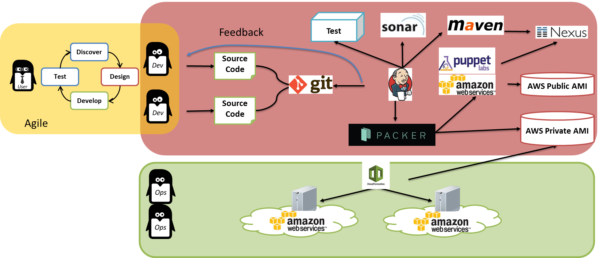
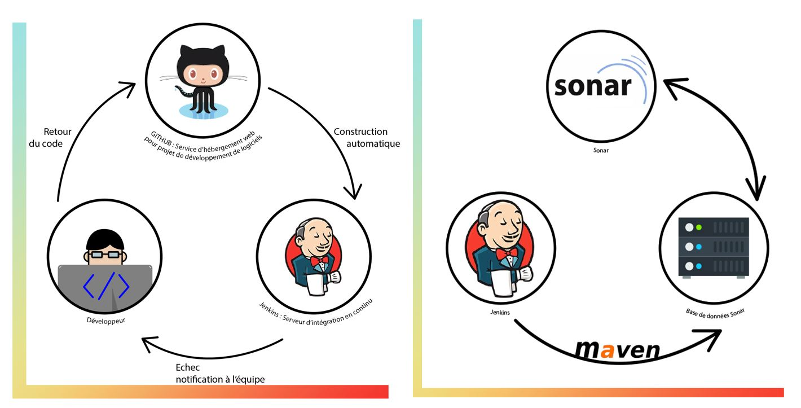
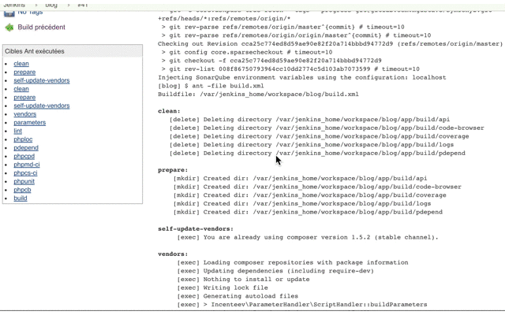

# CI Tools Demo

Working as a team promotes collaboration and improves the quality of work, but can also generate regressions. Fortunately, there is a set of practices to verify that each new deliverable does not generate regressions in the existing application.

We talk about Continuous Integration.

If we talk about IC, we necessarily talk about:

- Versioned code (Git).
- Automated tests (PHPUnit).
- IC Server (Jenkins, Travis, Bamboo ...)
- Measure the quality of the code (SonarQube).

In this article we will see an introduction to the Jenkins and SonarQube tools. 
 




# Docker, Jenkins, SonarQube

## 1. Docker

To use this program, you must have `docker` and `docker-compose` installed on your computer. The installation process can be found on the [official Docker website](https://www.docker.com/)

You should have Docker Toolbox installed, see https://www.docker.com/toolbox

I am using docker-compose to start several docker container at once.
Since all containers run in a single VM (virtualbox), this VM needs enough memory.

### Step 0 - Check Docker Machine version

Ensure that you are using version 0.3.0 or greater of `docker-machine`.

```
# docker-machine version
docker-machine version 0.8.2, build e18a919
```

### Step 1 - Start Docker Machine

Start the machine, using the `--virtualbox-memory` option to increase it’s memory.
I use 6000 MB to accommodate all the docker images.

```
# docker-machine create -d virtualbox --virtualbox-memory "6000" default
Running pre-create checks...
Creating machine...
(default) Creating VirtualBox VM...
(default) Creating SSH key...
(default) Starting VM...
Waiting for machine to be running, this may take a few minutes...
Machine is running, waiting for SSH to be available...
Detecting operating system of created instance...
Detecting the provisioner...
Provisioning with boot2docker...
Copying certs to the local machine directory...
Copying certs to the remote machine...
Setting Docker configuration on the remote daemon...
Checking connection to Docker...
Docker is up and running!
To see how to connect Docker to this machine, run: docker-machine env default
```

### Step 2 - Set Docker Machine Connection

Configure shell environment to connect to your new Docker instance

```
eval "$(docker-machine env default)"
```

### Step 3 - clone Repository

Clone Repository

```
git clone https://github.com/chouaibabou/integration.git intégration continue
cd integration_continue
```

### Step 4 -  Start the program

Now, you can start the program via the following command. Install and start the project:

```Bash
make start
```

#### With docker machine
 show service docker launcher
 ```Bash 
 make ps
 ```
 
    docker ps
    CONTAINER ID        IMAGE                 COMMAND                  CREATED             STATUS              PORTS                                              NAMES
    b5cc8f281827        integration_jenkins   "/bin/tini -- /usr..."   28 minutes ago      Up 28 minutes       0.0.0.0:8081->8080/tcp, 0.0.0.0:50001->50000/tcp   jenkins_1
    350288f77b6b        integration_sonar     "/bin/sh -c '/opt/..."   28 minutes ago      Up 28 minutes       9002/tcp, 0.0.0.0:9002->9000/tcp                   sonar_1
    463d41de508d        mysql:5.6             "docker-entrypoint..."   28 minutes ago      Up 28 minutes       3306/tcp                                           sql_sonar_1


  

## 2. Jenkins
Jenkins is an open source automation server written in Java. Jenkins helps to automate the non-human part of software development process, with continuous integration and facilitating technical aspects of continuous delivery. It is a server-based system that runs in servlet containers such as Apache Tomcat. It supports version control tools, including AccuRev, CVS, Subversion, Git, Mercurial, Perforce, ClearCase and RTC, and can execute Apache Ant, Apache Maven and sbt based projects as well as arbitrary shell scripts and Windows batch commands. The creator of Jenkins is Kohsuke Kawaguchi. Released under the MIT License, Jenkins is free software
Jenkins is available on the following ports:

- Jenkins: 8081

At the first start, Jenkins will ask you for a password. This password is displayed in the log. However, you can have access to this password via the container. 

To create a connection to the container, you have just to do this command:
```Bash 
make jenkins
```

## 2. SonarQube
SonarQube is an open source tool for quality system development. It is written in Java and supports multiple databases. It provides capabilities to continuously inspect code, show the health of an application, and highlight newly introduced issues. It contains code analyzers which are equipped to detect tricky issues. It also integrates easily with DevOps.

 SonarQube is available on the following ports:
 
   SonarQube: 9002
    
To create a connection to the container, you have just to do this command:
```Bash 
make sonar
```

## Access Tools

#### With docker machine

| *Tool* | *Link* | *Credentials* |
| ------------- | ------------- | ------------- |
| Jenkins | http://localhost:8081/ | admin/admin |
| SonarQube | http://localhost:9002/ | admin/admin |

### Jenkins stop

To remove docker containers
```Bash 
make stop
```
 
### Jenkins Jobs

There are several jobs preconfigured in Jenkins.
The Jobs cover the following tasks:

- Continuous Integration Build with Maven
- Unit Tests
- Static Source Analysis results are stored in SonarQube
- JaCoCo Test Coverage
- Deployment to Nexus
- Jenkins Job DSL examples
- Selenium UI Test


### SonarQube Dashboard




